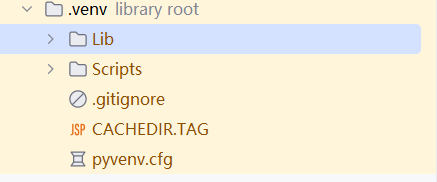
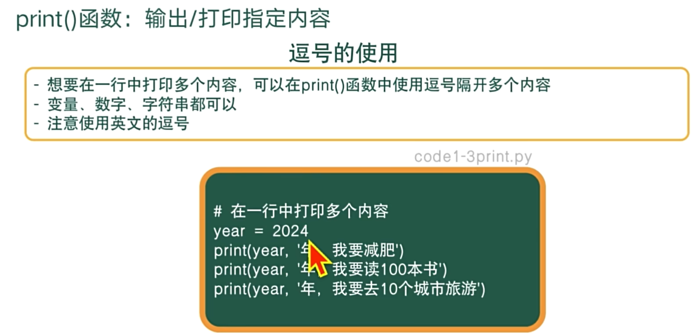
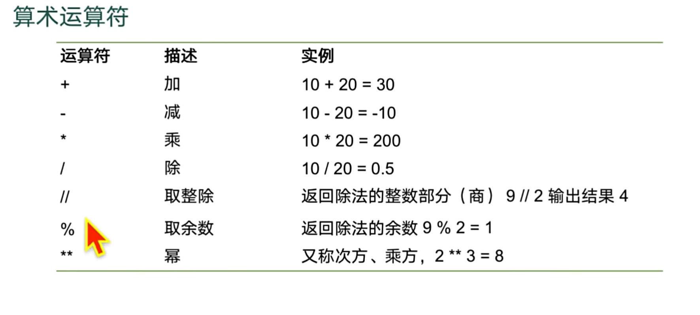
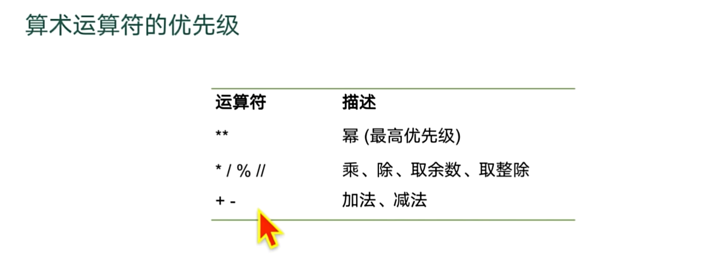
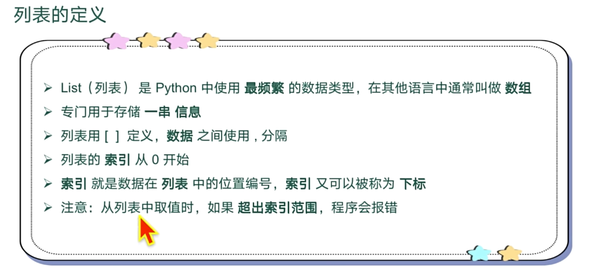
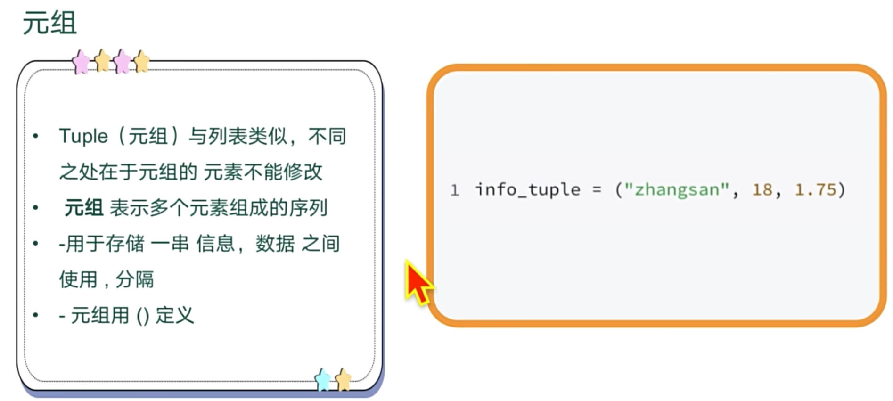
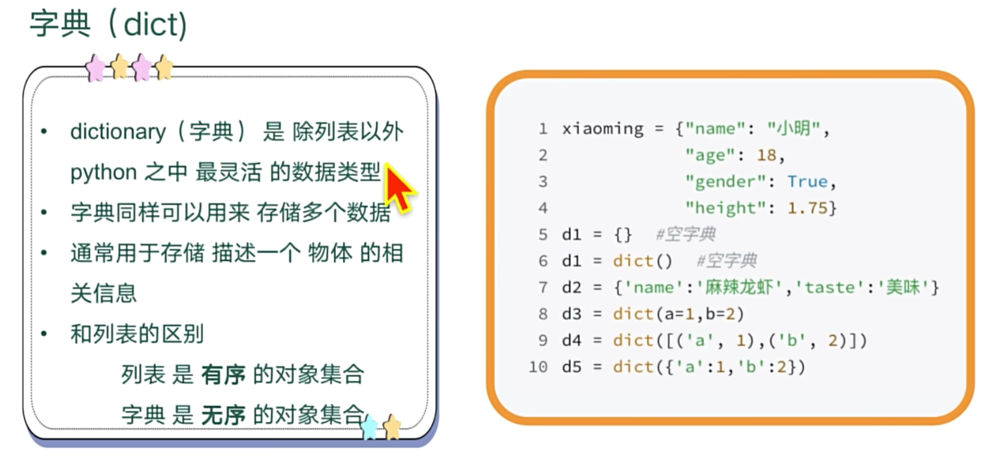

# python学习
## 环境说明
设置环境变量
```shell
python -m venv .venv
```
执行上述的命令就会生成.venv的私有环境


* .venv的作用


* 可以使用以下命令导出依赖清单
> pip freeze > requirements.txt

* 在新的环境中可以批量导入依赖
>pip install -r requirements.txt


## 常规的语法
### 注释
常见的注释方式:
* 块注释
> - 以#开始,一直到本行结束都是注释  
> - 为了保证代码的可读性,#后面建议先添加一个空格,然后再编写相应的说明文字(PEP8)    
> - 注释不会运行    
> - 代码是给机器执行用的,注释是给人看的,方便阅读代码时,能够快速的了解代码的功能   

* 行内注释
> - 以#开始,一直到本行结束都是注释
> - 与代码写在同一行
> - #前面至少有两个空格

* 多行注释

>如果希望编写的注释信息很多,一行无法显示,就可以使用多行注释
>-要在python程序中使用多行注释,可以用一对连续的三个引号(单引号和双引号都可 以)

多行注释的例子：
```python
#多行注释
#1.使用三个单引号
"中间的任何内容都是注释,
可以有多行但中间不能再有三个单引号"
#2.使用三个双引号
""中间都是注释内容,
但求出现三个双引号"""
```
[注释的示例](chapter1/comment.py)


* 在一行内打印多个内容

>print("2025","年-07","月-25日",sep="")

* 占位符
>#%02d表示如果要占两位，如果不够要使用0来替代
> print("今天是%d年%02d月%d日%s,风速%.2f米/s" % (2025,7,24,",今天是个好日子！！",3.145)) #今天是2025年07月24日,今天是个好日子！！,风速3.15米/s

* 字符串运算
> 使用+可以拼接字符串，使用 *数字 表示重复字符串多少次
[字符串运算](chapter2/strVariable.py)

* 字符串切片
> 语法 str[起始位置:最终位置+1:步长]
> 字符串切片包头不包尾，需要指定到输出位置的后一位，首位默认是0，末尾默认是-1，如果是从头到尾，可以不需要取写，默认就可以，例如content[::2]
[字符串运算](chapter2/strVariable.py)


* python 小整数
> -5~`256是会存在python的常量池里面，提高数据存取的速度。


## 算术运算符




[算术运算符](chapter3/calculate.py)


* 优先级



* 布尔运算中的短路运算
> 如果在布尔运算中使用的是布尔值，那么显示的就是布尔值，如果是其他类型的数值，如果那个数值表示的Flase，那么直接输出False,如果是true,就会输出逻辑运算中后面的数据

示例如下:
[短路运算](chapter3/boolcalculate.py)
```python
print("a" and "b")  # b
print("hello" and 4.23)  # 4.23
print('' and "demo")  # 输出空格
print(False and  'hi')  # False
```

## 分支结构

[match分支](chapter4/matchCondition.py)


## 数据类型

### 列表
* 列表的定义



### 元组
* 元组的定义


[元组示例](chapter6/tupleTest.py)


### 字符串操作

[字符串操作](chapter6/StrTest.py)


### 字典




